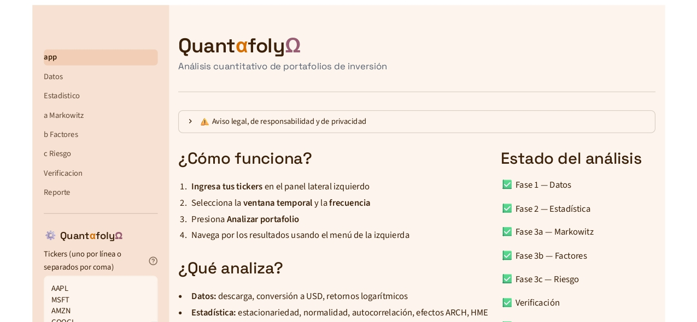
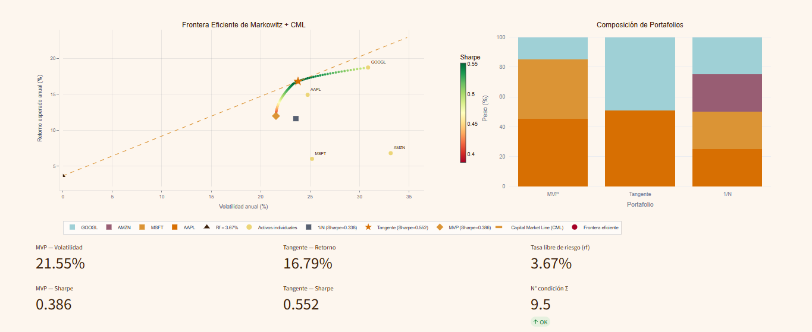
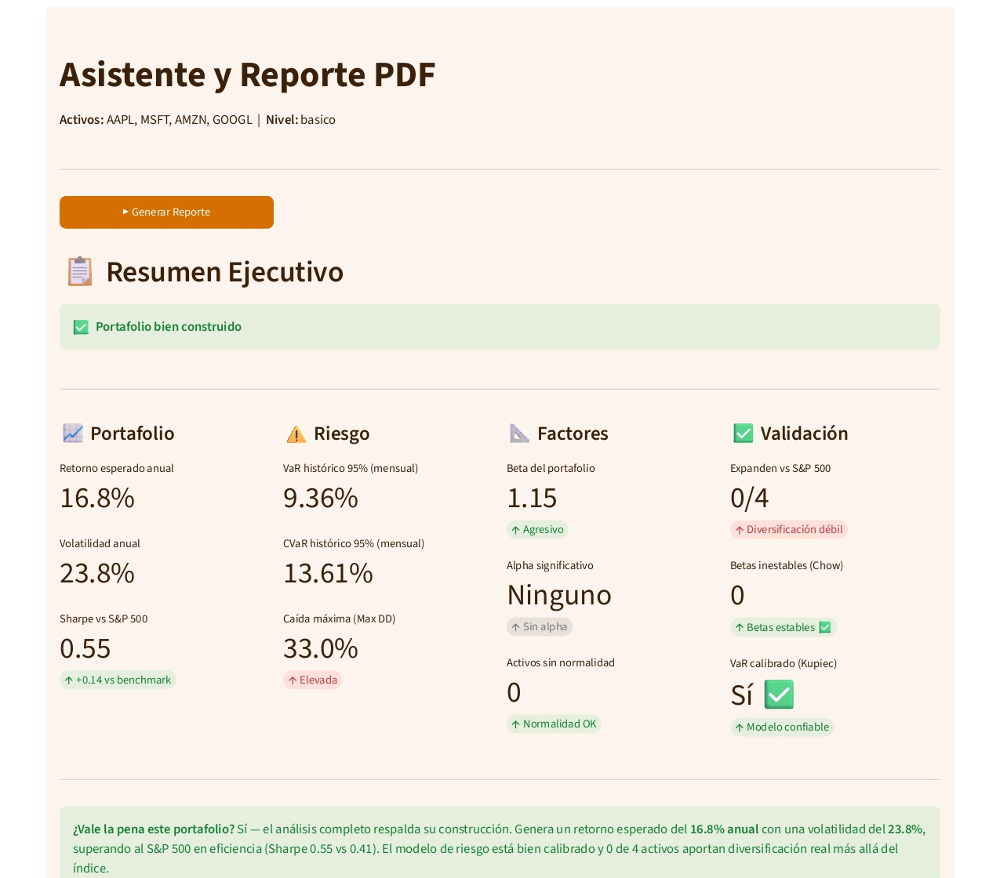
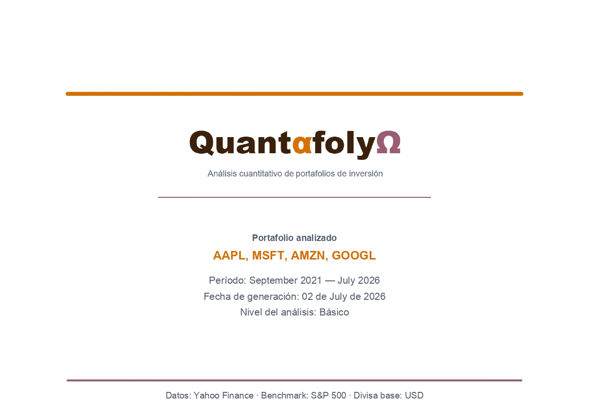

# QuantαfolyΩ

**Análisis cuantitativo de portafolios de inversión**

QuantαfolyΩ es una aplicación web construida en Python y Streamlit que permite analizar portafolios de inversión con rigor estadístico y econométrico. El usuario ingresa tickers, selecciona una ventana temporal y la app ejecuta automáticamente un pipeline completo de análisis — desde la descarga de datos hasta la generación de un reporte PDF descargable.

Desarrollado como proyecto de valor profesional por un estudiante de economía. Todo en español. Sin costos de hosting.

---

## Capturas

### Página de inicio


### Optimización de Markowitz


### Resumen Ejecutivo


### Reporte PDF


---

## Funcionalidades

### Fase 1 — Datos
- Descarga automática desde Yahoo Finance
- Conversión de divisas a USD
- Retornos logarítmicos
- Estadísticas descriptivas y visualización

### Fase 2 — Análisis Estadístico
- Estacionariedad: ADF, KPSS, Phillips-Perron
- Normalidad: Jarque-Bera, Shapiro-Wilk
- Dependencia: Pearson vs Spearman
- Autocorrelación: Ljung-Box
- Heterocedasticidad: ARCH-LM
- Normalidad multivariante: Mardia, Henze-Zirkler
- Semáforo consolidado de supuestos

### Fase 3a — Optimización (Markowitz, 1952)
- Frontera eficiente con Capital Market Line
- Portafolio de Mínima Varianza (MVP)
- Portafolio Tangente (máximo Sharpe)
- Equal-weight (1/N) como benchmark
- Métricas: Sharpe, Sortino, Calmar, Omega, Max Drawdown

### Fase 3b — Modelos de Factores
- CAPM — Sharpe (1964), Lintner (1965)
- Fama-French 3 Factores — Fama & French (1993)
- APT con PCA + selección automática AIC — Ross (1976), Chen et al. (1986)
- Comparativa de R² y alpha entre modelos

### Fase 3c — Riesgo
- VaR histórico, paramétrico y Monte Carlo (95% y 99%)
- CVaR / Expected Shortfall
- Backtesting: Kupiec POF y Christoffersen
- Análisis de estrés histórico (crisis 2008, 2020, 2022)
- Métricas avanzadas de desempeño

### Verificación Consolidada
- Prueba de Spanning — Huberman & Kandel (1987)
- Estabilidad de betas — Chow (1960)
- Consistencia entre modelos CAPM → FF3 → APT

### Fase 4 — Reporte
- Asistente narrativo en modo básico y técnico
- Resumen ejecutivo con semáforo global
- PDF descargable con gráficos incrustados
- 12 referencias bibliográficas

---

## Stack tecnológico

| Componente | Tecnología |
|---|---|
| Interfaz | Streamlit |
| Datos | yfinance, pandas-datareader |
| Econometría | statsmodels, arch, scipy, pingouin |
| Optimización | cvxpy |
| Visualización | Plotly |
| PDF | reportlab, kaleido |
| Machine Learning | scikit-learn (PCA) |

---

## Instalación

### Requisitos
- Python 3.10+
- pip

### Pasos

```bash
# 1. Clonar el repositorio
git clone https://github.com/tu-usuario/quantafolyo.git
cd quantafolyo

# 2. Instalar dependencias
pip install -r requirements.txt

# 3. Ejecutar la aplicación
streamlit run app.py
```

La app abre automáticamente en `http://localhost:8501`

---

## Uso

1. Ingresa los tickers en el panel lateral (ej: `AAPL`, `MSFT`, `AMZN`, `GOOGL`)
2. Selecciona la ventana temporal (1-10 años) y la frecuencia (mensual o semanal)
3. Elige el nivel del asistente: **Básico** (lenguaje accesible) o **Técnico** (terminología académica)
4. Presiona **Analizar portafolio**
5. Navega por las fases en el menú lateral
6. En la Fase 4 genera el reporte PDF descargable

### Formatos de tickers soportados

| Mercado | Ejemplo |
|---|---|
| EE.UU. | `AAPL`, `MSFT`, `TSLA` |
| Alemania | `SAP.DE`, `BMW.DE` |
| Japón | `7203.T`, `6758.T` |
| Colombia | `ECOPETROL.CL` |
| ETFs | `SPY`, `QQQ`, `IWM` |

---

## Arquitectura

```
quantafolyo/
├── app.py                  ← entrada + sidebar + session_state
├── config.py               ← parámetros globales y paleta de colores
├── requirements.txt
├── .streamlit/
│   └── config.toml         ← tema visual
├── modulos/
│   ├── datos.py            ← descarga y limpieza
│   ├── estadistico.py      ← pruebas estadísticas
│   ├── markowitz.py        ← optimización de portafolio
│   ├── factores.py         ← CAPM, FF3, APT
│   ├── riesgo.py           ← VaR, CVaR, backtesting
│   ├── verificacion.py     ← spanning, Chow, consistencia
│   ├── reporte.py          ← asistente narrativo + PDF
│   └── errores.py          ← mensajes de error amigables
└── pages/
    ├── 1_Datos.py
    ├── 2_Estadistico.py
    ├── 3a_Markowitz.py
    ├── 3b_Factores.py
    ├── 3c_Riesgo.py
    ├── 4_Verificacion.py
    └── 5_Reporte.py
```

**Principios de diseño:**
- Sin escritura a disco — todo pasa por `st.session_state`
- Factor de anualización dinámico por frecuencia (12/52/252)
- Módulos independientes con contratos claros de entrada/salida
- Mensajes de error interpretados, no trazas de Python

---

## Referencias bibliográficas

- Markowitz, H. (1952). Portfolio Selection. *Journal of Finance*, 7(1), 77-91.
- Sharpe, W. F. (1964). Capital Asset Prices. *Journal of Finance*, 19(3), 425-442.
- Lintner, J. (1965). The Valuation of Risk Assets. *Review of Economics and Statistics*, 47(1), 13-37.
- Ross, S. A. (1976). The Arbitrage Theory of Capital Asset Pricing. *Journal of Economic Theory*, 13(3), 341-360.
- Fama, E. F. & French, K. R. (1993). Common Risk Factors in the Returns on Stocks and Bonds. *Journal of Financial Economics*, 33(1), 3-56.
- Chen, N., Roll, R. & Ross, S. A. (1986). Economic Forces and the Stock Market. *Journal of Business*, 59(3), 383-403.
- Artzner, P. et al. (1999). Coherent Measures of Risk. *Mathematical Finance*, 9(3), 203-228.
- Kupiec, P. H. (1995). Techniques for Verifying the Accuracy of Risk Measurement Models. *Journal of Derivatives*, 3(2), 73-84.
- Christoffersen, P. F. (1998). Evaluating Interval Forecasts. *International Economic Review*, 39(4), 841-862.
- Huberman, G. & Kandel, S. (1987). Mean-Variance Spanning. *Journal of Finance*, 42(4), 873-888.
- Chow, G. C. (1960). Tests of Equality Between Sets of Coefficients. *Econometrica*, 28(3), 591-605.
- Michaud, R. O. (1989). The Markowitz Optimization Enigma. *Financial Analysts Journal*, 45(1), 31-42.

---

## Notas técnicas

- **Fama-French:** descarga el ZIP directamente de la Ken French Data Library parseando línea por línea. Si falla, usa proxies ETF (SPY/IWM/IVE/IVW) como fallback con advertencia al usuario.
- **APT:** selección automática de factores macro con PCA + criterio AIC. Mínimo 80% de varianza explicada por los componentes retenidos.
- **VaR Monte Carlo:** 10,000 simulaciones con matriz de covarianza Cholesky.
- **kaleido:** requerido para incrustar gráficos Plotly en el PDF. Verificar instalación con `python -c "import plotly.graph_objects as go; go.Figure().to_image(format='png')"`.

---

*Datos: Yahoo Finance · Benchmark: S&P 500 · Divisa base: USD*
